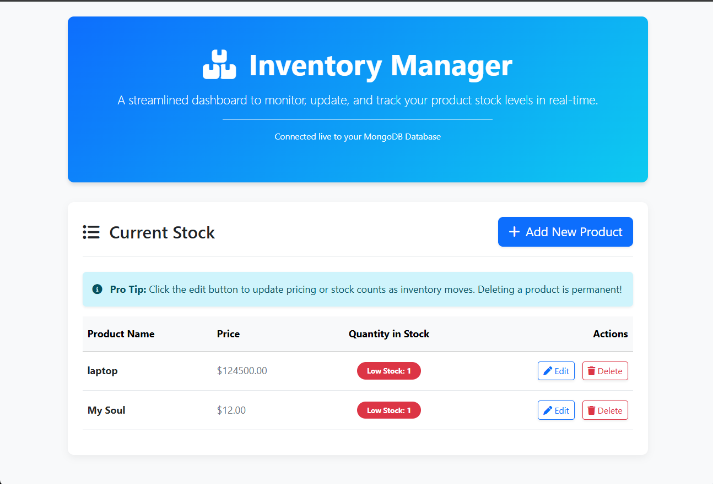
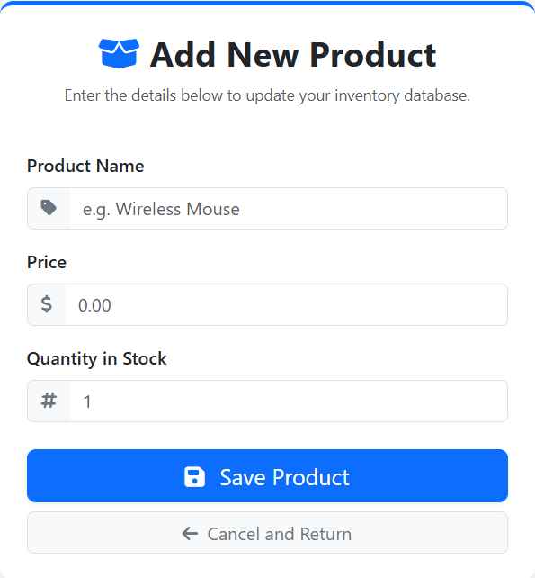

# Product Inventory Manager

This is a full stack application, built to manage the flow of incoming and outgoing stock. It uses MongoDb as the main database to store the information about the items.

## 📸 Dashboard Preview

### adding an item
By clicking on "add new product" the user can add another type of product or model, User cannot add the same product twice, "laptop" and "Laptop" are considered the same.

## 🛠️ Technologies Used
* **Frontend:** HTML5, Bootstrap 5, JavaScript (Fetch API), SweetAlert2
* **Backend:** ASP.NET Core (C# Minimal API)
* **Database:** MongoDB (Community Server)

## 🚀 Setup Instructions

### Prerequisites
1. Install [.NET 8.0 SDK](https://dotnet.microsoft.com/download)
2. Install [MongoDB Compass](https://www.mongodb.com/products/tools/compass) and ensure it is running on `mongodb://localhost:27017`

### Running the Backend
1. Open a terminal and navigate to the `InventoryBackend` folder.
2. Run the command to install the database driver:
   `dotnet add package MongoDB.Driver`
3. Start the server by running:
   `dotnet run`
4. The server will start on a local port (e.g., `http://localhost:5161`).

### Running the Frontend
1. Open the `InventoryFrontend` folder.
2. Open `index.html` or `manage.html` in your code editor.
3. Ensure the `API_URL` variable at the top of the `<script>` tag matches the port your backend is running on.
4. Double-click `index.html` to open it in any modern web browser.
